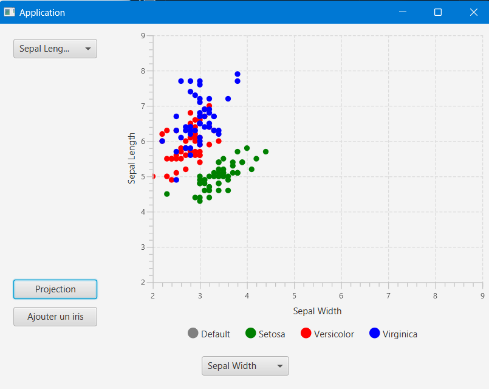

# PROJET DE CLASSIFICATION DE DONNÉES

**Réalisé par :**  
DE JESUS TEIXEIRA Lucas  
WILFART Axel  
LAMOUR Enzo  
RANDOUX Martin

*Projet réalisé pour la SAE3.02 - Développement d'une application*

---

## Description : 

Projet qui permet de développer un outil de chargement et d'affichage d'un ensemble de données. Il permet également de classer une donnée par rapport aux données déjà chargées.

---

## Comment lancer l'application :

**Voici les étapes pour lancer l'application :**

**Pour Exécuter sur Linux:**  
`chmod u+x run.sh`  
`./run.sh`  
*Si maven est installé dans votre machine, la commande devrait s'éxécuter*

**Pour Exécuter depuis VSCode :**
- Lancer run, dans le programme Main.java

**Une fois arrivé sur l'interface, vous pouvez réaliser ses différentes actions :**

**Vous pouvez soit fournir les 2 colonnes que vous voulez vérifier, puis cliquer sur "Projection" pour afficher le résultat :**

**Soit cliquez sur "Ajouter un iris", il faudra définir les différents paramètres et la variété (vous pouvez le laisser en Default) du nouveau Iris qui sera affiché après que vous aurez valider :**

**C'est tout, pour le Jalon 1 de la SAE.**

*Sinon, pour nous, aucune issue demandée n'est manquante, et les javadocs seront générés pour le Jalon2.*